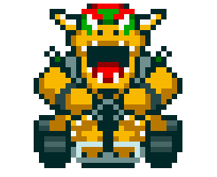

<div align="center">
<pre>
 __  __              _             _       _   _  _   ___ 
|  \/  | ___  _ __  (_)  ___      | | __ _| | | |/ | / _ \
| |\/| |/ _ \| '_ \ | | / __|  _  | |/ _` | | | | | || | | |
| |  | |  __/| | | || || (__  | |_| | (_| | | | | | || |_| |
|_|  |_|\___||_| |_||_| \___|  \___/ \__,_|_|_| |_|_| \___/ 
                                                          
</pre>
</div>

<div align="center">
  
</div>

## 🎯 MISSÃO DO PROJETO

Mario Kart é uma série de jogos de corrida desenvolvida e publicada pela Nintendo.  
Nosso desafio será **criar uma lógica para simular corridas de Mario Kart**, levando em consideração as regras e mecânicas de um jogo clássico.

---

## 🏎️ SELECIONE SEU JOGADOR

| Personagem | Atributos | Personagem | Atributos | Personagem | Atributos |
|-------------|------------|-------------|------------|-------------|------------|
| <div align="center"><br><code>MARIO</code></div> | `Velocidade [4]`<br>`Manobrabilidade [3]`<br>`Poder [3]` | <div align="center"><br><code>PEACH</code></div> | `Velocidade [3]`<br>`Manobrabilidade [4]`<br>`Poder [2]` | <div align="center"><br><code>YOSHI</code></div> | `Velocidade [2]`<br>`Manobrabilidade [4]`<br>`Poder [3]` |
| <div align="center"><br><code>BOWSER</code></div> | `Velocidade [5]`<br>`Manobrabilidade [2]`<br>`Poder [5]` | <div align="center"><br><code>LUIGI</code></div> | `Velocidade [3]`<br>`Manobrabilidade [4]`<br>`Poder [4]` | <div align="center"><br><code>DONKEY KONG</code></div> | `Velocidade [2]`<br>`Manobrabilidade [2]`<br>`Poder [5]` |

---

## 🕹️ COMO JOGAR

Antes de começar, certifique-se de ter o **[Node.js](https://nodejs.org/en)** instalado.

Execute o comando abaixo no terminal:

```bash
node seu_arquivo.js
```

---

## 📘 MANUAL DO JOGO

```
[ JOGADORES ]
[x] O computador deve receber dois personagens para disputar a corrida.

[ PISTAS ]
[x] Os personagens correm em uma pista de 5 rodadas.
[x] A cada rodada, um tipo de pista é sorteado:
    - RETA:      Rolar dado de 6 lados + VELOCIDADE → vencedor ganha 1 ponto.
    - CURVA:     Rolar dado de 6 lados + MANOBRABILIDADE → vencedor ganha 1 ponto.
    - CONFRONTO: Rolar dado de 6 lados + PODER → perdedor perde 1 ponto.
[x] Nenhum jogador pode ter pontuação negativa (abaixo de 0).

[ CONDIÇÃO DE VITÓRIA ]
[x] Ao final das 5 rodadas, vence quem acumulou mais pontos.
```

---

## 👨‍💻 TECNOLOGIAS UTILIZADAS

- JavaScript (Node.js)
- Lógica de programação
- Simulação com dados aleatórios

---

## 🏁 AUTOR

Projeto desenvolvido para fins didáticos e de simulação.  
Feito com para fins de estudo.
